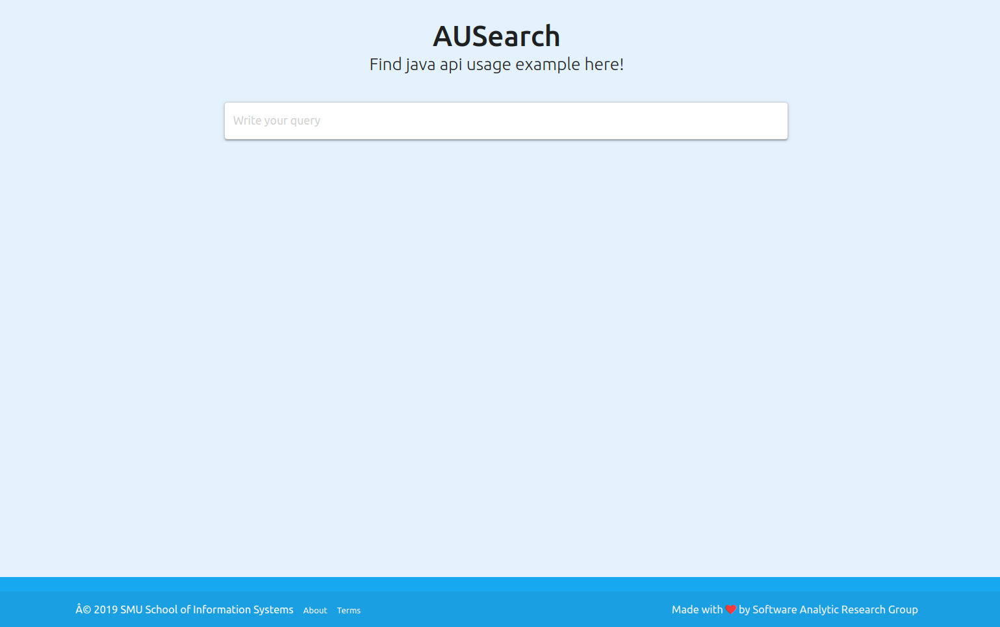
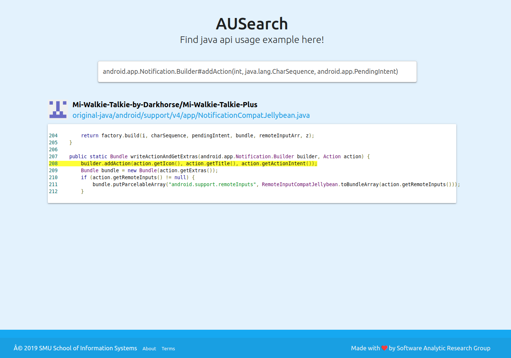

## AUSearch

Code for SANER 2020 "AUSearch: Accurate API Usage Search in Github Repositories with Type Resolution" by [Muhammad Hilmi Asyrofi](https://www.linkedin.com/in/mhilmiasyrofi/), [Ferdian Thung](https://scholar.google.com/citations?hl=en&user=47okQ-UAAAAJ), [David Lo](https://scholar.google.com/citations?user=Ra4bt-oAAAAJ&hl=en), and [Lingxiao Jiang](https://scholar.google.com/citations?hl=en&user=0hssXLPZL2YC)

[Paper PDF](https://docs.google.com/viewer?url=https://raw.githubusercontent.com/mhilmiasyrofi/ausearch/master/SANER_2020_AUSearch.pdf) | [DOI](https://ieeexplore.ieee.org/document/9054809)


#### Find API usage example here!
AUSearch is a web apps that helps you to find some API usage examples from java source code. Given an API query that allows type constraints, AUSearch finds code examples in GitHub that contain usages of the specific APIs in the query. AUSearch performs type resolutions to ensure that the API usages found in
the returned files are indeed invocations of the APIs specified in the query and highlights the relevant lines of code in the files for easier reference.

## Prerequisite

- [Java Development Kit (JDK)](https://www.oracle.com/technetwork/java/javase/downloads/index.html), version 1.8.
- [Apache Maven](https://maven.apache.org/), version 3.0 or later.
- [GitHub OAuth Token](https://github.com/settings/tokens). Please read the **Getting Started** part carefully :)

## Getting Started

First, you should set some Github OAuth tokens into your laptop/computer environment variable, like this:
```
export GITHUB_AUTH_TOKEN_1=xxxxxxx
export GITHUB_AUTH_TOKEN_2=xxxxxxx
export GITHUB_AUTH_TOKEN_3=xxxxxxx
```
Visit this [link](https://github.com/settings/tokens) to create it. If you just have one token only, please write your token in each environment variable. It will works also :). 


## How to Run

```
<go to the project directory>

mvn spring-boot:run

<go to your favorite web browser>
<navigate to localhost:8080>
```

If you run it successfully, you can see this cool landing page :)


Keep calm, the best part will come soon. Please type your query then submit it!

## API Query
This app will help you if you type the query correctly. So read this part carefully :). The query consist of 3 main parts; fully qualified name, method, and its parameter.
Some accepted queries example:
#### 1. One query without parameter
```
android.net.ConnectivityManager#getAllNetworkInfo()
```
#### 2. One query with one parameter
```
android.app.Notification.Builder#addAction(android.app.Notification.Action)
```
#### 3. One query with two parameters or more
```
android.app.Notification.Builder#addAction(int, java.lang.CharSequence, android.app.PendingIntent)
```
#### 4. Multiple queries
```
android.os.Vibrator#vibrate(long)&android.location.LocationManager#removeGpsStatusListener(android.location.GpsStatus.Listener)
```

This is one of the example if you write correct query.



## Developer Mark 
**Note** that this apps is already tested on Ubuntu and Mac OS. Unfortunately, this doesn't work well on Microsoft shell because of the multi-threading part. Don't worry, we still find the solution for this.
I know that you still not sure with this app because off the small commit changes. You can find more commit changes on this [repository](https://github.com/mhilmiasyrofi/github-code-search) (I develop on CLI before). You can use that repo also if you prefer to see the result on terminal only. If you find a problem while using this apps, please notify me via [this](mhilmia@smu.edu.sg) email. I will help you soon to ensure that you can try this amazing apps immediately :).

#### Please Cite This!
```
@INPROCEEDINGS{Asyrofi2020AUSearch,  
  author={M. H. {Asyrofi} and F. {Thung} and D. {Lo} and L. {Jiang}},  
  booktitle={2020 IEEE 27th International Conference on Software Analysis, Evolution and Reengineering (SANER)},   
  title={AUSearch: Accurate API Usage Search in GitHub Repositories with Type Resolution},   
  year={2020},  volume={},  number={},  
  pages={637-641},  
  doi={10.1109/SANER48275.2020.9054809}}
```


